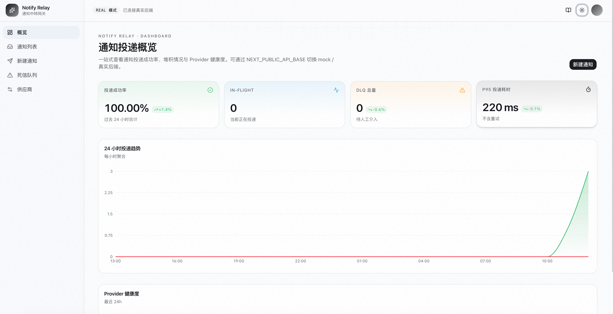

# rc_caohongwei — API 通知系统（MVP）

> 一个内部"通知中转网关"：业务系统把对外通知请求交给它，由它负责**可靠地**送达到不同供应商的 HTTP(S) API。

**技术栈**:
- 后端 — Python 3.11 + FastAPI + SQLite + APScheduler
- 前端 — Next.js 15 + shadcn/ui + Tailwind v4 + framer-motion + recharts

**开发范式**: Spec-Driven（OpenSpec）— 先 spec、后实现
**当前阶段**: spec 完成；后端 MVP（97 个测试通过）+ 前端 5 页面已联调通过——前端可在 `NEXT_PUBLIC_API_BASE` 指向真实后端时直连；本仓库自带本地 `tools/mock_provider.py` 让三个 demo provider 离线可达，无需任何外部环境变量



---

## 一、问题理解

企业内部多个业务系统需要在关键事件发生后调用第三方 HTTP API（广告 / CRM / 库存）。表面是"转发一次 HTTP 请求"，真正难的是三件事：

1. **主链路与外部依赖解耦**：业务侧期望"调一下就走"，外部世界却充满超时、限流、长期不可用。直接调用会让外部故障反向污染主链路。
2. **抹平 N×M 异构性**：每家供应商 URL/Header/Body/鉴权各不相同，不能让每个业务系统各自适配。
3. **可靠性与幂等的张力**：要"稳定送达"必然需要重试，重试就会重复——必须明确投递语义并把幂等责任划清楚。

### 我的判断："题眼"不在于把功能写全，而在于敢砍

- **要做的**：接收 → 持久化 → 异步可靠投递（含重试 / 退避 / 熔断 / 死信）
- **不做的**：可视化模板配置、多租户配额、多协议（gRPC/Kafka 投递）、回执回调、消息编排——V2+ 考虑

---

## 二、整体架构

```
   业务系统                 通知系统（本仓库）                外部供应商
  ┌────────┐  POST    ┌──────────────────────────────┐   HTTPS
  │  注册  │  ───►    │  Intake API (FastAPI)        │
  │  支付  │          │   ├─ 幂等校验（idempotency）  │
  │  订单  │  ◄── 202 │   └─ 落库（SQLite）          │
  └────────┘          │             │                │
                      │             ▼                │
                      │  ┌────────────────────────┐  │
                      │  │ Outbox Table           │  │
                      │  │ (PENDING / IN_FLIGHT / │  │
                      │  │  SUCCEEDED/DEAD_LETTER)│  │
                      │  └────────────────────────┘  │
                      │             │                │
                      │             ▼                │
                      │  Dispatcher (APScheduler)    │  HTTPS
                      │   ├─ Provider 适配器         │  ────►  ┌────────┐
                      │   ├─ 指数退避 + jitter       │         │ 广告   │
                      │   ├─ Vendor 维度熔断         │         │ CRM    │
                      │   └─ DLQ 兜底                │         │ 库存   │
                      └──────────────────────────────┘         └────────┘
```

### 核心数据流（状态机）

```
PENDING ──► IN_FLIGHT ──► SUCCEEDED
   ▲              │
   │              ├── retryable?  → 计算 next_retry_at → PENDING
   │              │   (5xx / 429 / 网络 / 超时)
   │              │
   └──────────────┴── 终态 ──────────────────────────► DEAD_LETTER
                      (4xx 非 429 / 模板渲染错 / attempts ≥ 8)
```

> 失败后**不引入独立的 FAILED 状态**：直接回写 `PENDING + next_retry_at`，让"该不该派发"由一条 SQL 谓词回答，而不是由状态机分支回答——调度器逻辑因此简化为单一查询。

### 模块拆分（Capabilities）

| Capability | 职责 |
|------------|------|
| `notification-intake` | HTTP 收单接口、幂等校验、持久化、立即返回 202 |
| `notification-delivery` | Outbox 轮询、Provider 适配、HTTP 投递、重试 / 熔断 / DLQ |

---

## 三、关键工程决策与取舍

### 决策 1：投递语义 = **At-Least-Once**

- Exactly-Once 在跨系统场景物理不可达（外部已收到但响应丢失，无法区分），所以**不假装做到 Exactly-Once**。
- 对调用方：暴露 `Idempotency-Key`，相同 key 的请求只会落库一次。
- 对外部供应商：在文档中**明确声明** "本系统提供至少一次语义，业务方需保证下游接口幂等"——这是边界，不是 bug。
- 调用方未带 `Idempotency-Key` 时：服务端按 `(provider, sha256(payload))` **兜底生成**幂等键并打 warning 日志——可用性优先，但不沉默地放过疏漏。

### 决策 2：队列 = **DB 作为队列**（首版不引入 MQ）

- **取**：SQLite + `SELECT ... WHERE next_retry_at <= now AND status='PENDING' LIMIT N`，配合行锁 / 乐观锁拿工作单元。
- **舍**：Kafka / RabbitMQ / Redis Stream。理由：MVP 量级 < 100 QPS，引入 MQ 增加一个有状态依赖、一个故障域、一份运维成本，**对当前阶段是负担**。
- **演进路径**：当稳态写入超过单机 DB 写吞吐（约 5k QPS）或需要多消费者组时，把 outbox 表替换为 Kafka topic，**业务接口与状态机不变**。

### 决策 3：重试策略 = **指数退避 + jitter + 可配置上限**

- 退避序列定义：`1s, 5s, 25s, 2m, 10m, 1h, 6h, 24h`（最多覆盖 ~31h，对标 Stripe webhook 长维护窗口语义）。
- 实际上限由 `MAX_RETRY_ATTEMPTS` 配置，**默认 4**——MVP / 演示场景下覆盖到 ~3 分钟足够；真上生产可在 `.env` 调到 8 拿到完整 31h 容忍度。把"序列长度"和"实际生效上限"解耦，避免改默认时动到 backoff 表。
- jitter：±20% 随机化，避免大量重试同时打到刚恢复的供应商。
- 4xx（非 429）立即进 DLQ，不重试——这是业务错误，重试无意义。
- 5xx / 网络错误 / 429 / 超时 → 重试。

### 决策 4：熔断 = **Vendor 维度的简单计数器**

- 同一 vendor 连续失败 ≥ **5 次** → OPEN 态，**5 分钟**内不派发新单（**仍接收入库**，避免反向污染收单接口）。
- OPEN 期满 → HALF_OPEN，放行**一单**试探：成功回 CLOSED，失败重新 OPEN。
- 不引入 Sentinel / Resilience4j 全套——一个 `dict[str, BreakerState] + timestamp` 就够 MVP 演示。

### 决策 5：Provider 适配 = **配置 + 模板**而非插件化

- `providers.yaml` 描述 URL / method / header 模板 / body 模板（Jinja2）/ 鉴权方式。
- **舍**：插件化 SPI、动态加载。MVP 阶段配置文件足够，新增供应商不需要改代码即可加一条配置。

### 决策 6：可观测 = **结构化日志 + 关键指标 + Dashboard 聚合接口**

- JSON 日志（每个 notification 全生命周期可串起来）。
- `/metrics`（Prometheus 文本格式）暴露成功率、重试分布、DLQ 计数、投递耗时直方图。
- `/v1/metrics/summary`（JSON）专为前端 dashboard 提供已聚合的成功率 / inflight / dlqTotal / p95 / 24h 趋势 / by-provider 切片——与 Prometheus 抓取并行，不互相依赖。
- p95 用 Histogram bucket 线性插值估算（`app/core/metrics.py:estimate_percentile_seconds`），代价是 ±一个 bucket 边界的精度，但避免持久化每次延迟。


### 决策 7：本地 mock provider = **演示零依赖的关键工具**

- `tools/mock_provider.py` 是一个 ~50 行的 stdlib HTTP echo 服务，支持 `--fail-rate` 注入 5xx / 超时。
- 让评审者 clone 后**不需要任何外部 token、不需要联网**就能跑出"成功投递 + 偶发失败 + 重试 → 成功"的完整链路；dashboard 数字也因此从一开始就有真实样本。
- 这条本质是 README 决策 1 "幂等责任两段划分" 的对偶——演示环境也要把外部依赖砍干净，让链路在本机自洽。

> AI 协作过程（哪些建议被采纳 / 否决 / 哪些是人类判断）见 **§七 AI 使用说明**，不在此重复。

---

## 四、未来演进路径

| 阶段 | 触发条件 | 演进动作 |
|------|----------|---------|
| V1 | 当前 | DB 轮询 + 单进程 worker + SQLite |
| V1.5 | 写入 > 1k QPS 或多实例部署 | SQLite → PostgreSQL；worker 多进程 + `FOR UPDATE SKIP LOCKED` |
| V2 | 写入 > 5k QPS 或跨机房 | Outbox → Kafka；保留 DB 作 audit / replay |
| V2.5 | 业务方需要回执 | 增加 webhook 回调通知投递结果 |
| V3 | 多协议 / 编排 | 引入 DSL 描述工作流；接入 Temporal 等 |

---

## 五、项目结构

```
rc_caohongwei/
├── README.md                  # 本文件
├── openspec/                  # OpenSpec 规范工件
│   ├── specs/                 # 已批准的能力规约（archive 后落入此处）
│   └── changes/
│       ├── archive/
│       ├── init-notification-mvp/   # 后端 MVP（spec 完成）
│       │   ├── proposal.md
│       │   ├── design.md
│       │   ├── specs/
│       │   └── tasks.md
│       └── add-frontend-console/    # 前端 console（spec + 代码已落地）
│           ├── proposal.md
│           ├── design.md
│           ├── specs/
│           └── tasks.md
├── app/                       # 后端应用代码
│   ├── api/                   # FastAPI 路由：notifications / dlq / providers / metrics / health
│   ├── core/                  # 配置、日志、DB、自实现 Prometheus、Provider 注册表
│   ├── delivery/              # Worker、重试、熔断、Provider 适配、Dispatcher
│   ├── models/                # ORM / 数据模型
│   └── main.py
├── web/                       # 前端 Next.js 子项目（已实现）
│   ├── app/                   # 路由 + 页面（5 页）
│   ├── components/            # shadcn UI + 共享组件
│   ├── lib/                   # api（mock + real 双客户端）/ hooks / types / template
│   └── README.md              # 前端独立说明
├── tools/
│   └── mock_provider.py       # 本地 echo 服务，支持 --fail-rate 注入 5xx / 超时
├── tests/                     # 97 个用例覆盖 backoff/breaker/classifier/intake/e2e/renderer/listing/metrics-summary/providers/metrics-module
├── providers.yaml             # 默认指向本地 mock，零外部依赖即可跑通
├── providers.example.yaml     # 真实接入示意（example.com + bearer/header auth）
└── pyproject.toml
```

---

## 六、运行

仓库默认配置已经跑得通，**不需要任何外部 token / 联网**。三个进程：mock provider（提供 demo 上游）、后端、前端。

### 1) 装依赖

```bash
uv venv --python 3.11
uv pip install -e ".[dev]"

cd web && npm install && cd ..
```

### 2) 跑测试（可选，验证后端基线）

```bash
uv run pytest -q   # → 97 passed
```

### 3) 启动三个进程（建议三个终端）

```bash
# T1: 本地 mock provider（fail-rate 注入 15% 失败让 dashboard 不全绿）
uv run python tools/mock_provider.py --port 8500 --fail-rate 0.15

# T2: 后端 API + Worker（同进程；首次启动自动建表 + 加载 providers.yaml）
uv run uvicorn app.main:app --port 8000

# T3: 前端 Next.js（指向真实后端；缺省此变量则进 MOCK 模式）
cd web && NEXT_PUBLIC_API_BASE=http://localhost:8000 npm run dev
```

打开 http://localhost:3000 即可看到 dashboard 直连真实后端：成功率 / 24h 趋势 / 三个 provider 的熔断态与 24h 成功率曲线。

### 4) 接口清单

| 方法 | 路径 | 说明 |
|---|---|---|
| `POST` | `/v1/notifications` | 收单。Header `Idempotency-Key` 可选；命中已有 → `duplicated:true` |
| `GET` | `/v1/notifications` | 列表。query：`status / provider / q / fromTs / toTs / limit / offset` |
| `GET` | `/v1/dead-letters` | DLQ 查询，参数同列表（隐含 `status=DEAD_LETTER`） |
| `GET` | `/v1/providers` | Provider 配置 + 当前熔断态 + 24h 成功率序列 |
| `GET` | `/v1/metrics/summary` | Dashboard 用聚合 JSON：successRate / inflight / dlqTotal / p95LatencyMs / trend / byProvider |
| `GET` | `/metrics` | Prometheus 文本格式（counters / gauges / histogram） |
| `GET` | `/healthz` | DB + scheduler 健康 |

### 5) 提交一条通知

```bash
curl -X POST http://localhost:8000/v1/notifications \
  -H "Content-Type: application/json" \
  -H "Idempotency-Key: 7c83-2025-001" \
  -d '{
    "provider": "demo-crm",
    "payload": {"user_id": 42, "event": "subscription.paid", "metadata": {"plan": "pro"}}
  }'
# → 202 Accepted
# → {"id":"ntf_xxx","status":"PENDING","duplicated":false}
#    再发一次相同 Idempotency-Key → duplicated:true
```

更详细的 4 个场景演示（成功 / 重试 / DLQ / 幂等）见 [`docs/demo.md`](docs/demo.md)。

### 6) 真实接入

把 `providers.yaml` 改回 `providers.example.yaml` 那样的外部 URL + bearer/header auth；在 `.env` 里设置 `CRM_TOKEN / AD_API_KEY` 等环境变量。`MAX_RETRY_ATTEMPTS / BREAKER_FAIL_THRESHOLD / CORS_ALLOW_ORIGINS` 都可在 `.env` 覆盖。

### 7) 部署到云

仓库根目录已带 `Dockerfile` / `.dockerignore` / `fly.toml`，可零成本部署到云。两份指南：

- [`docs/DEPLOY-HF.md`](docs/DEPLOY-HF.md)（**推荐 / 不绑卡**）—— 后端 Hugging Face Spaces（Docker，含容器内 mock）+ 前端 Vercel。**不要信用卡、不要 VPS**，GitHub 登录即可。代价是 SQLite 临时存储（48h idle 后清空，演示无影响）
- [`docs/DEPLOY-ZEABUR.md`](docs/DEPLOY-ZEABUR.md) —— Zeabur 一站式（已改 BYO server 模式，需自带 VPS 或购买他们的算力）

仓库还附带 `fly.toml` 用于 Fly.io 部署（持久化 SQLite via Volume，但 Fly 现需绑信用卡，故未列为主路径）。

---

## 七、AI 使用说明

> 详细分类记录见 [`docs/AI-USAGE.md`](docs/AI-USAGE.md)（apply 阶段同步更新）。本节给出概要。

### AI 在哪些**关键节点**提供了帮助

| 节点 | AI 贡献 | 是否采纳 |
|------|---------|---------|
| 问题域梳理 | 列出通知系统的典型失败模式（4xx/5xx/超时/限流/DNS/TLS/模板错） | ✅ 全部纳入错误分类表 |
| 退避序列经验值 | 提议 `1s, 5s, 25s, 2m, 10m, 1h, 6h, 24h`（覆盖 ~31h） | ✅ 直接采纳 |
| Jitter 比例 | 初版 ±10% | ⚠️ 我改为 ±20%——多 worker 场景下打散惊群更稳 |
| Provider 适配抽象 | 提议 SPI / 每 provider 一个 class | ❌ 改为 YAML + Jinja2，少一层抽象 |
| Spec 边界追问 | 在 spec 阶段质问"未带幂等键怎么办" | ✅ 触发"按 sha256(payload) 兜底"的设计 |
| 前后端字段命名 | 给"alias_generator=to_camel" / "前端写映射层" / "前端改 snake_case" 三选一 | ✅ 让 Python 内部保持 PEP 8、JSON 出口转 camelCase——两边各自符合自己语言惯例 |

### AI 给出但我**未采纳**的建议（决策对照）

| AI 建议 | 否决理由 | 详见 |
|---------|---------|------|
| 一上来就上 mq + 多消费者组 | MVP < 100 QPS，多一个有状态依赖 | 决策 2 |
| 引入 Celery + Redis broker | APScheduler 单进程已够，少一个依赖 | 决策 6（design） |
| 全套 OpenTelemetry + Jaeger | 结构化日志已能回答 95% 排障问题 | 决策 6 |
| 引入 Saga / 事件溯源 | 通知是"开火即忘"，无编排需求 | Non-Goals |
| 多租户配额 + 可视化配置后台 | 题目未要求；演示价值低 | Non-Goals |
| 把 4xx/5xx 当作可重试统一处理 | 4xx 是业务错，重试是浪费且会反复打到供应商 | 决策 3 + spec 错误分类表 |

### 哪些是**我自己做的关键决策**（AI 没主动提）

1. **承认 At-Least-Once 而非追求 Exactly-Once** ——
   物理不可达，与其加复杂度伪装，不如把幂等责任在文档里**显式**划分两段（入站 / 出站）。
2. **DB 作队列 + 失败回写 PENDING（无独立 FAILED 状态）** ——
   "该不该派发"由一条 SQL 谓词 `status='PENDING' AND next_retry_at<=now` 回答，而非状态机分支。调试与回放成本被压到最低。
3. **熔断粒度 = vendor，不到 endpoint** ——
   同一供应商不同 endpoint 故障相关性高（多半是其后端整体抖动），过细粒度反而失去保护意义。
4. **不做投递回执回调** ——
   PDF 原文"业务方不关心返回值"是契约边界。做了就是越界。
5. **前端 mock-first（不强依赖后端）** ——
   评审者 clone 后 `npm i && npm run dev` 立刻能看完整 UI；切换真实后端只改一个 `.env.local`。组件代码对 mock/real 不可见。
6. **动画限定在过渡 / 状态变化场景** ——
   AI 倾向"全屏炫技"，但过密动画反而让人晕。最终只在路由切换、数字滚动、staggered 列表、OPEN 脉冲、详情抽屉 5 类场景使用 framer-motion，hover 一律走 CSS。

---

## 八、提交清单（对应作业要求）

- [x] 设计文档（本 README + `openspec/changes/init-notification-mvp/` + `openspec/changes/add-frontend-console/`）
- [x] 前端 MVP 代码实现（`web/`，5 个页面已可运行；已与真实后端联调通过）
- [x] 后端 MVP 代码实现（`app/`，FastAPI + APScheduler + SQLite；**97 个测试通过**）
- [x] 前后端字段对齐（Pydantic `alias_generator=to_camel`；前端零映射代码）
- [x] 演示零依赖（`tools/mock_provider.py`，无需外部 token / 联网）
- [x] AI 使用说明（第七节 + [`docs/AI-USAGE.md`](docs/AI-USAGE.md)）
